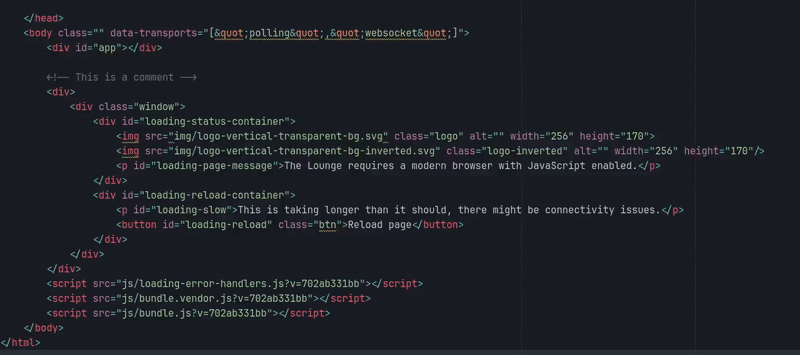

# Sublime - Select Closing Tag
Select the closing / opening HTML / XML tag with a shortcut.

You can select many tags, press the shortcut, and all closing / opening tags will be selected.



```json
{
    "keys": ["ctrl+shift+d"],
    "command": "select_closing_html"
}
```
